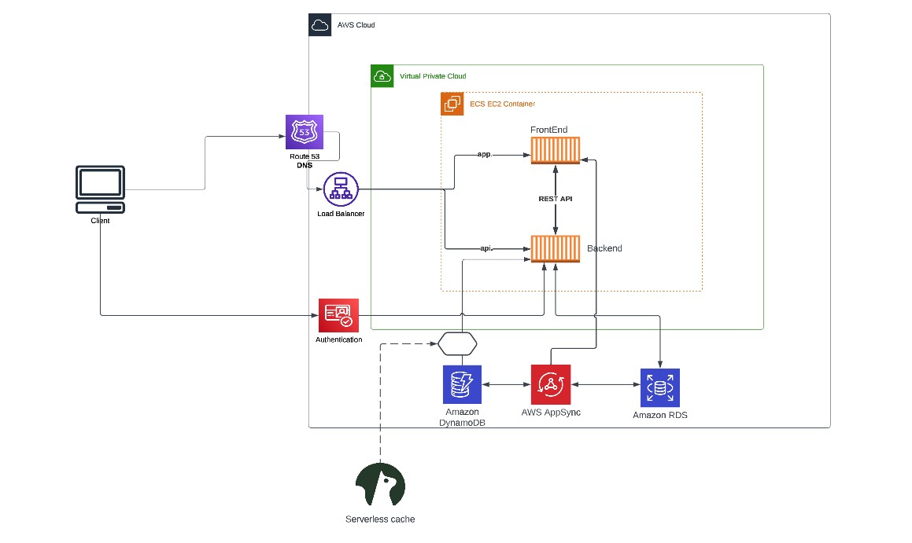

# Week 0 — Billing and Architecture

## Required Tasks
---

## Install and Verify AWS CLI

I was able to install the aws cli both on gitpod and also on my windows wsl

### Installing AWS CLI on windows wsl

  I followed the instructions in the [AWS CLI Documentation](https://docs.aws.amazon.com/cli/latest/userguide/getting-started-install.html) and was able to install the **aws cli** successfully

  

  I configured my aws credentials and used the command `aws sts get-caller-identity`

  

## Create a Budget

I created an AWS Monthly budget cost of $1 using the aws cli

  

## Recreate Logical Architectural Deisgn

I was able to reproduce the [Crudder Logical Architectural Diagram](https://lucid.app/lucidchart/631b0077-c9b2-4a3b-b503-82c38d5aecdf/edit?viewport_loc=-74%2C-70%2C2226%2C1014%2C0_0&invitationId=inv_d5062f14-56b2-4e86-ae91-0a57925a2ac6) on Lucid Charts

