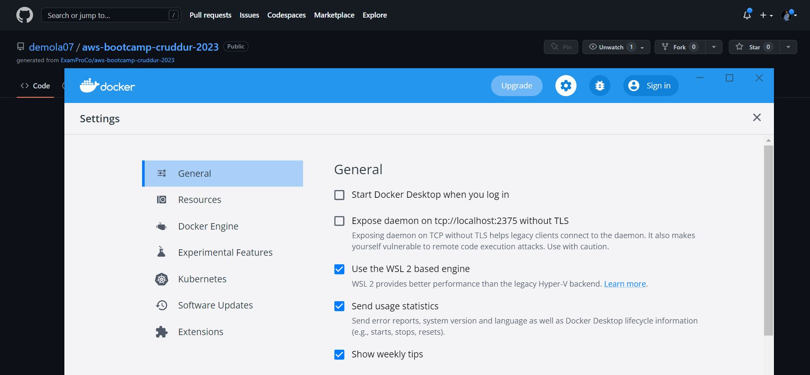
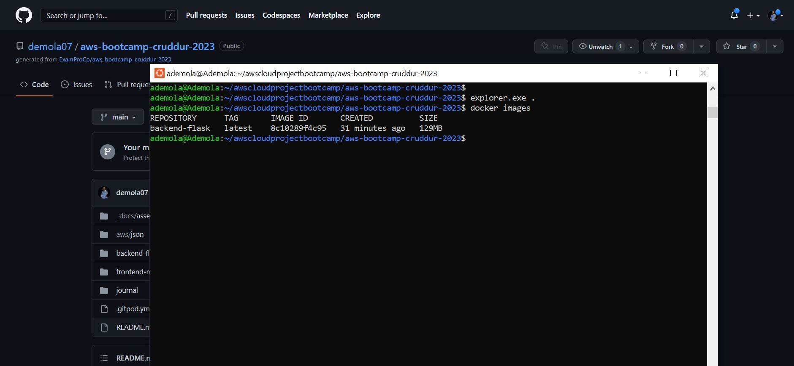
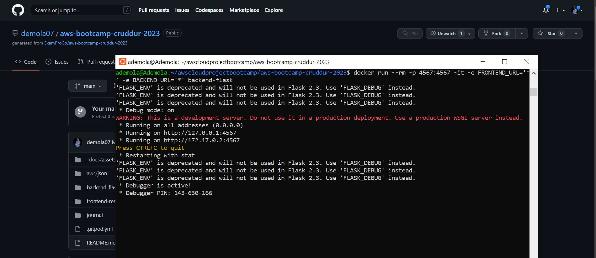
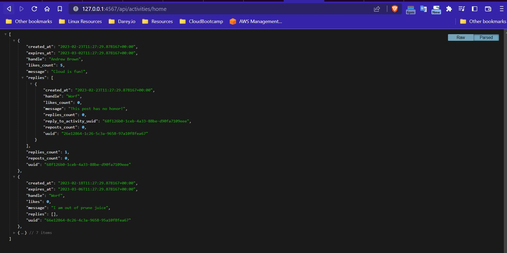
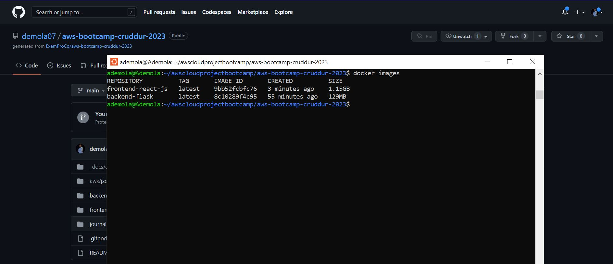
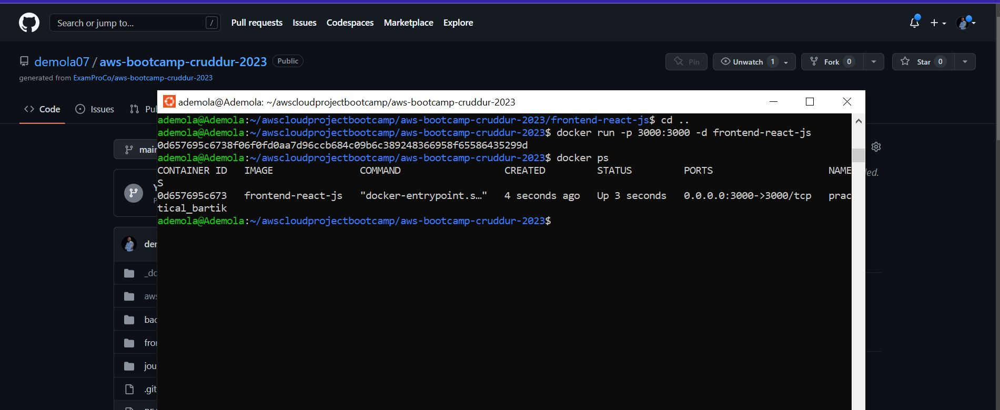
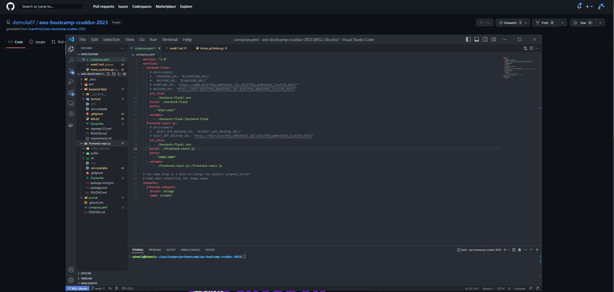
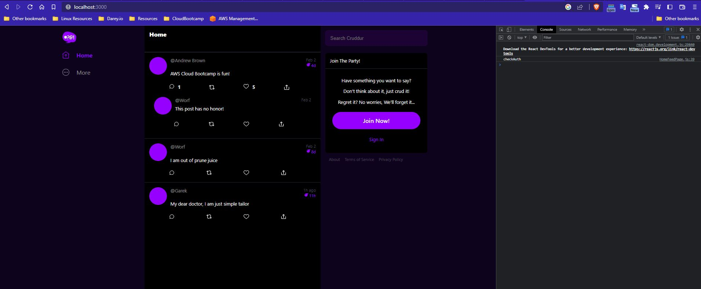
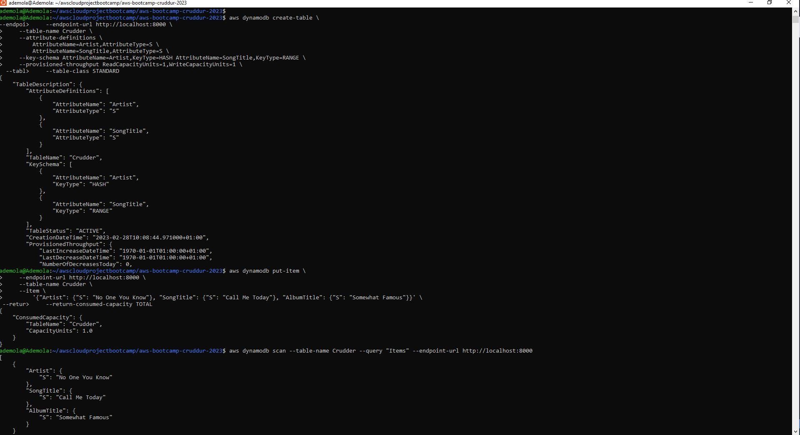
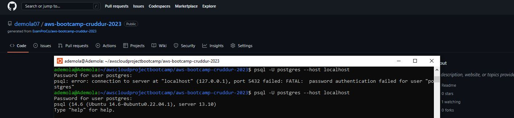

# Week 1 — App Containerization

## Required Tasks
---

### *_Build Backend Flask Image_*

I was able to run docker desktop on my local machine, and enable the WSL 2 based engine because I am using windows WSL

  

I was able to build the docker image of the backend flask application using the command `docker build -t  backend-flask ./backend-flask`

  

  ### *_Run Backend Flask Container_*

Thereafter I wasn able to create a container with the *backend-flask* image using the command `docker run --rm -p 4567:4567 -it -e FRONTEND_URL='*' -e BACKEND_URL='*' backend-flask`

  

  ### *_Query Backend API_*

going to my browser and inputting the url `http://127.0.0.1:4567/api/activities/home` I was able to query the results below

  

### *_Build Frontend React Image_*

I first created a Dockerfile in the frontend folder and thereafter built the frontend react image using the command `docker build -t frontend-react-js ./frontend-react-js`

  

### *_Create Frontend React Containere_*

I ran the command `docker run -p 3000:3000 -d frontend-react-js` to create the frontend react container from the *frontend-react-js* image

  

## Multiple Containers

I created compose.yaml at the root of my project.

### Challenges 

I faced a couple of challenges with this docker compose file.

 - Environmental Variables: I had to look for a way to reference the environmental variables locally, since I was runing the project locally with windows WSL. After searching for answers, I came across an article titled [Taking Advantage of the docker-compose Environment Variables](https://adamtheautomator.com/docker-compose-environment-variables/). Using this article I was able to learn how to reference environmental variable in the `docker compose` file to the `.env` file. I also learnt how to reference a custom environment variable file e.g `.env-prod` in the `docker compose` file.

 -  Second challenge I faced was with `CORS`, also because I was running the project locally. I was able to get a solution in the *Discord week-1-docker channel*. All I had to do was to change ` resources={r"/api/*": {"origins": origins}}` to ` resources={r"/api/*": {"origins": "*"}}` in the `app.py` file. and the project was able to run successfully with no errors

  

  

### _* Run Dynamo Db and Postgres Containers *_

I was able to successfully run the dynamo_db container, and also create a table, insert values and query the values following the instructions in [100DaysofCloudChallenge](https://github.com/100DaysOfCloud/challenge-dynamodb-local)

  

I was able run the postgres container and access it via the client, all I had to do was install the postgres client using the command `sudo apt install postgresql-client`

  

  

