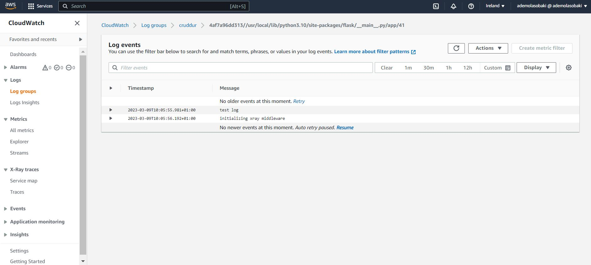

# Week 2 — Distributed Tracing

## Implementing Honeycomb

I was able to follow the instructions on instrumenting honeycomb with the flash backend service successfully.

  

  

  

### Creating Spans

  For `/home/activities`

   

   

  ### Adding Attributes to Spans

  

  
   

  ### Heatmap and P90

  

---
## Implementing AWS X-ray for Flask

  

  

  

### Instrumenting AWS X-Ray Subsegments

I was able to instrument aws xray subsugments following the instuctions and [Olga Timofeeva's article](https://olley.hashnode.dev/aws-free-cloud-bootcamp-instrumenting-aws-x-ray-subsegments)

 

 

 ## Integrate Rollbar for Error Logging

 I was able to successfully integrate rollbar into the crudder application.

  

  Rollbar was able to detect the error activitiy created.

  

  

  

  ## Implementing CloudWatch Logs, install WatchTower, write a custom logger

  

  
