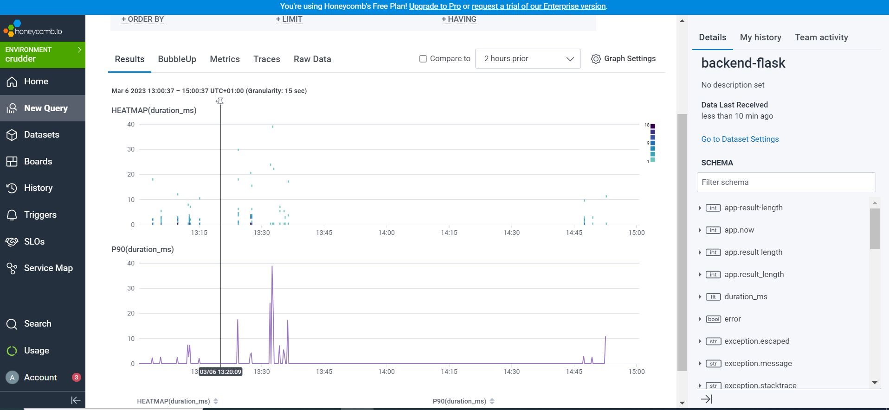

# Week 2 — Distributed Tracing

## Implementing Honeycomb

I was able to follow the instructions on instrumenting honeycomb with the flash backend service successfully.

  

  

  

### Creating Spans

  For `/home/activities`

   

   

  ### Adding Attributes to Spans

  

  
   

  ### Heatmap and P90

  

