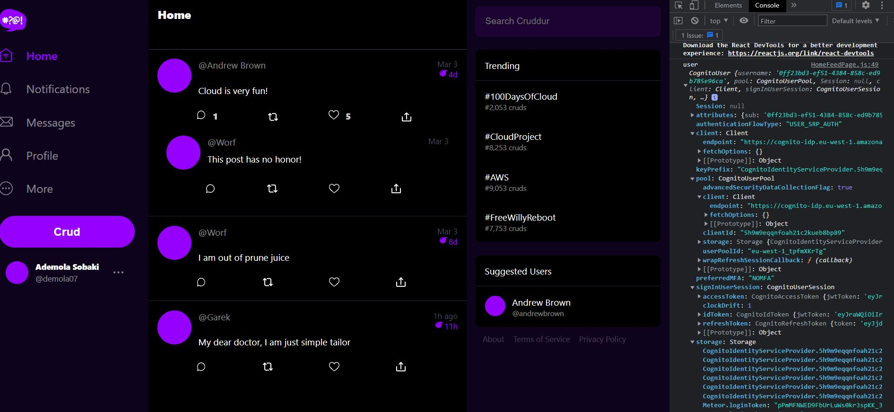
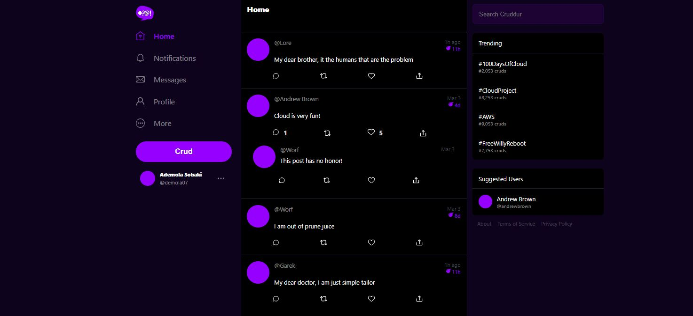

# Week 3 — Decentralized Authentication

## Provision Amazon Cognito User Pool

I was able to provision a coginto user pool 

 

 I then was able to  create a user, after implementing the signin, signup and recovery pages on the frontend

 

 I got the verification mail in my mailbox

 

 

And I was able to successfully signin

 

Confirmation of user on aws cognito

 

 ### Cognito JWT Server Side verification

 I was able to folow the instructions and successfully implement the server side jwt verification.

  *Signed in*
 

  *Signed out*
 

