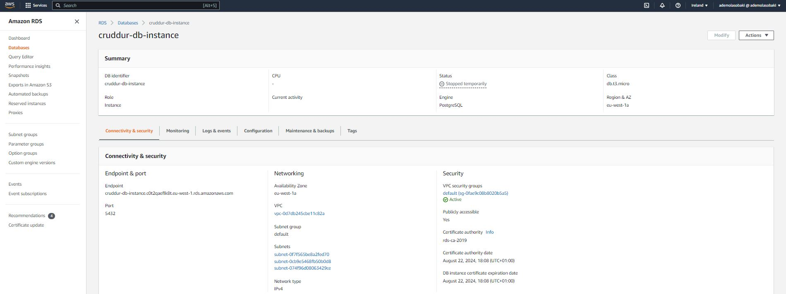
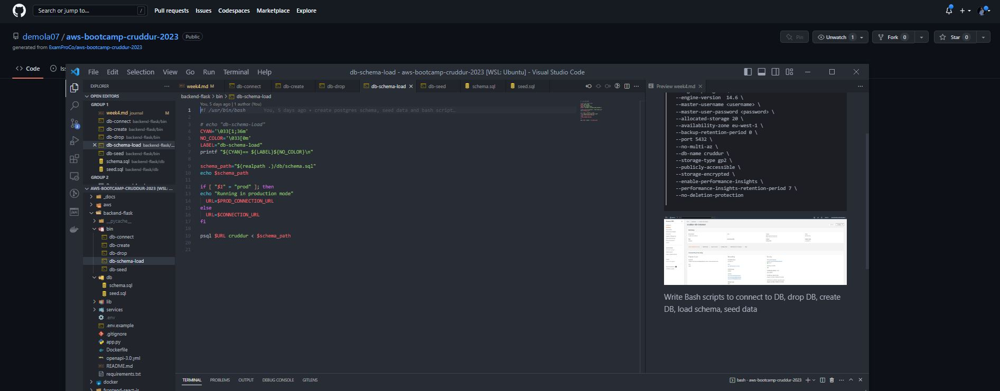
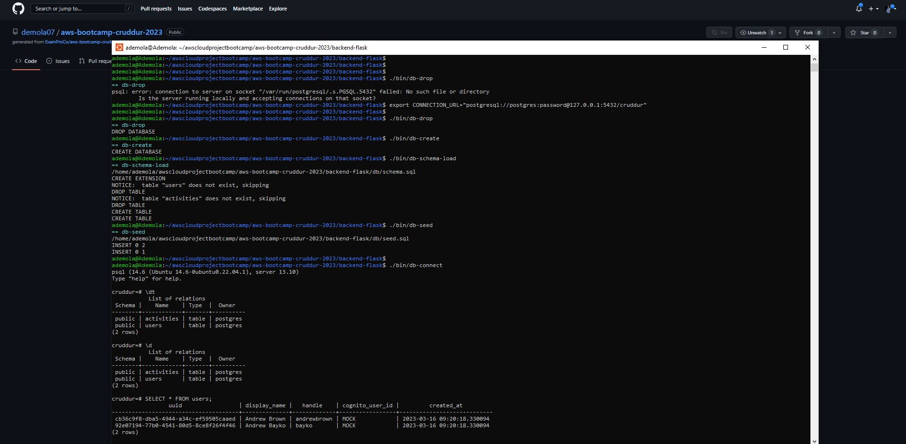

# Week 4 — Postgres and RDS

## Create AWS RDS instance

I was able to successfully create an RDS instance on AWS via the command line

```
aws rds create-db-instance \
  --db-instance-identifier cruddur-db-instance \
  --db-instance-class db.t3.micro \
  --engine postgres \
  --engine-version  14.6 \
  --master-username <username> \
  --master-user-password <password> \
  --allocated-storage 20 \
  --availability-zone eu-west-1 \
  --backup-retention-period 0 \
  --port 5432 \
  --no-multi-az \
  --db-name cruddur \
  --storage-type gp2 \
  --publicly-accessible \
  --storage-encrypted \
  --enable-performance-insights \
  --performance-insights-retention-period 7 \
  --no-deletion-protection

```

  

  ## Write Bash scripts to connect to DB, drop DB, create DB, load schema, seed data

  

  


