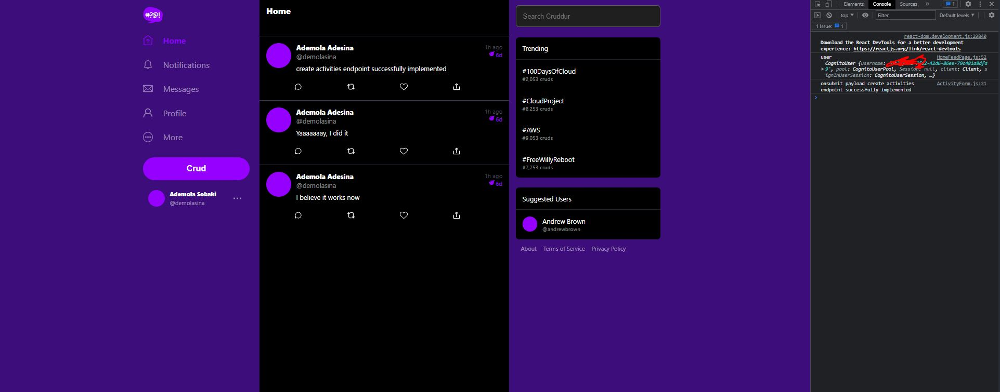

# Week 4 — Postgres and RDS

## Create AWS RDS instance

I was able to successfully create an RDS instance on AWS via the command line

```
aws rds create-db-instance \
  --db-instance-identifier cruddur-db-instance \
  --db-instance-class db.t3.micro \
  --engine postgres \
  --engine-version  14.6 \
  --master-username <username> \
  --master-user-password <password> \
  --allocated-storage 20 \
  --availability-zone eu-west-1 \
  --backup-retention-period 0 \
  --port 5432 \
  --no-multi-az \
  --db-name cruddur \
  --storage-type gp2 \
  --publicly-accessible \
  --storage-encrypted \
  --enable-performance-insights \
  --performance-insights-retention-period 7 \
  --no-deletion-protection

```

  

  ## Write Bash scripts to connect to DB, drop DB, create DB, load schema, seed data

  

  


## Implement queries

I was able to successfully implement the query to get all home activities data

 

 ### Connect to AWS RDS

 I was able to successfully connect to my provisioned AWS RDS instance

  

### Implement Cognito Post Confirmation lambda

I was able to successfully implement the cognito post confirmation lambda, and was able to successfully signup into cruddur

  

  

  


### Creating activities endpoint
I was able to create the activities endpoint in the backend flask application

*Challenge encountered*: 
I encountered a challenge and was getting the error `AttributeError: 'NotNullViolation' object has no attribute 'pgerror'`. 
I was able to figure out the solution by following the conversations on discord. I had to pass the user handle in the frontend react app, as it was hardcoded on the backend. 

  

  

  


