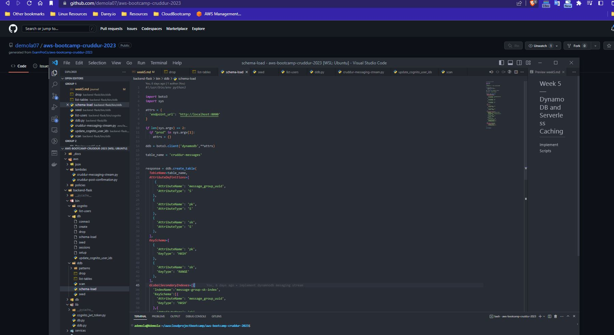
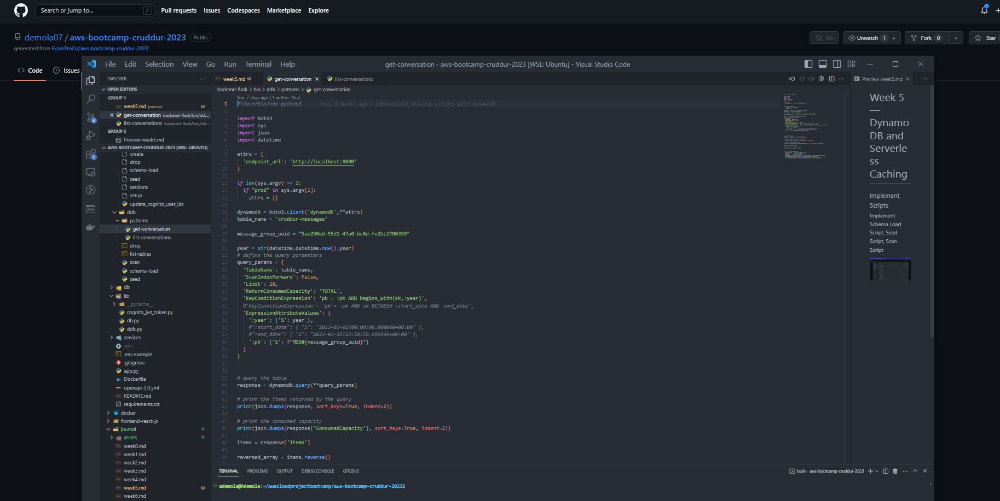
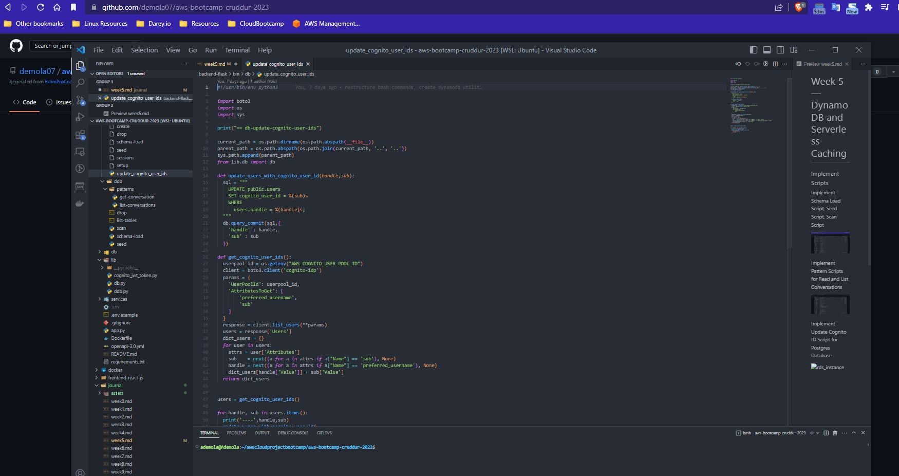
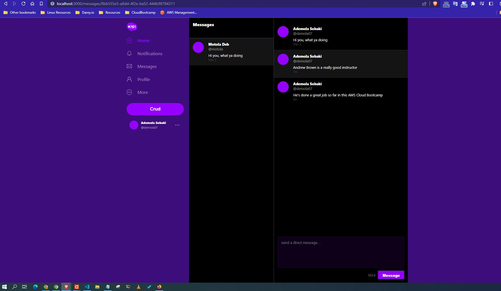
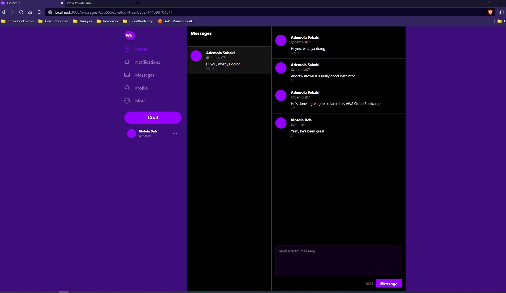
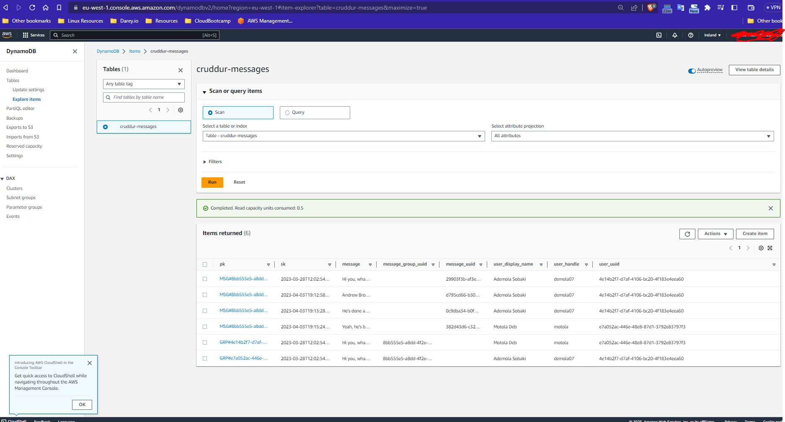

# Week 5 — DynamoDB and Serverless Caching

### Implement Scripts

Implement Schema Load Script, Seed Script, Scan Script

  

Implement Pattern Scripts for Read and List Conversations

  

Implement Update Cognito ID Script for Postgres Database

  

### Implements Patterns A - E

Pattern A Listing Messages in Message Group into Application

Pattern B Listing Messages Group into Application	

Pattern C Creating a Message for an existing Message Group into Application	

Pattern D Creating a Message for a new Message Group into Application	

Pattern E Updating a Message Group using DynamoDB Streams

  

  

### AWS DynamoDB table

